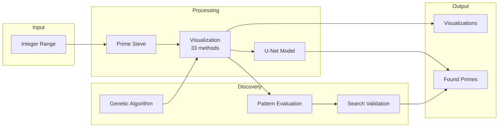

# Prime_Plot_AI

Python tool for visualizing prime number patterns and detecting primes using machine learning. Features evolutionary discovery of optimal visualization parameters and visualization-guided prime search.

**Repository:** [github.com/rondidon/Prime_Plot_AI](https://github.com/rondidon/Prime_Plot_AI)

## Features

- **33 Visualization Methods**: Ulam spiral, Sacks spiral, Klauber triangle, Vogel spiral, Fibonacci spirals, modular arithmetic plots, plus novel and predictive visualizations
- **Visual Pattern Analysis**: Detects diagonal/curved patterns, removes known mathematical structure, generates comparison mosaics
- **Evolutionary Discovery**: Genetic algorithm to discover optimal visualization parameters
- **ML-Based Detection**: U-Net models trained to identify prime patterns
- **Visualization-Guided Search**: Use learned patterns to find primes more efficiently
- **Scale-Invariant Coordinates**: Linear/modular coordinates that work from 100K to 1B+ scale
- **GPU Acceleration**: CUDA support for training and inference

## Installation

```bash
# Basic installation
pip install -e .

# With development dependencies
pip install -e ".[dev]"

# With high-performance prime generation
pip install -e ".[fast]"

# With GPU support
pip install -e ".[gpu]"
```

## Quick Start

### Generate Visualizations

```bash
# Ulam spiral
python -m prime_plot.cli ulam --size 500 --output ulam.png

# Sacks spiral
python -m prime_plot.cli sacks --max-n 100000 --size 1000 --output sacks.png

# Modular clock (shows primes in residue classes)
python -m prime_plot.cli modular --max-n 100000 --type clock --modulus 30 --output mod_clock.png

# Vogel spiral (golden angle)
python -m prime_plot.cli vogel --max-n 100000 --scaling sqrt --output vogel.png
```

### Visual Pattern Analysis

Analyze prime visualizations to detect and remove known mathematical structure:

```bash
# Run full visual analysis with all 33 methods
python run_visual_analysis.py --max-n 50000 --image-size 500

# Quick analysis
python run_visual_analysis.py --max-n 20000 --no-extension --no-efficiency
```

**Output includes:**
- `mosaic_visualizations.png` - All methods sorted by quality (best top-left)
- `mosaic_residuals.png` - Residuals after removing known patterns
- `{method}_known_patterns.png` - Known structure marked in RED
- `{method}_residual.png` - Primes remaining after pattern removal
- `{method}_comparison.png` - 3-panel: original | marked | residual

### Autonomous Discovery Engine

Run continuous discovery of novel N-dimensional visualizations:

```bash
# Run for 8 hours exploring 2D, 3D, and 4D visualizations
python run_autonomous_discovery.py --hours 8 --dimensions 2,3,4

# Run for 1000 cycles
python run_autonomous_discovery.py --cycles 1000 --dimensions 2,3

# Quick test run
python run_autonomous_discovery.py --cycles 10 --population 5 --end-n 10000
```

The engine:
- Generates random N-dimensional coordinate mappings
- Detects patterns using multi-method approach (3D volumetric + multi-axis projections)
- Removes known mathematical structure and tests if residuals extend
- **Visual auditing**: Saves 3-panel comparison images (original | known patterns | residual)
- Generates sorted mosaic of all evaluations for expert review
- Runs autonomously with graceful shutdown (Ctrl+C saves progress)
- Full logging to `logs/run.log` with error recovery

### Evolutionary Discovery

Discover optimal visualization parameters using genetic algorithm:

```bash
# Run discovery with default settings
python run_discovery.py

# Quick test run
python run_discovery.py --quick
```

### Prime Search

Use visualization patterns to find primes more efficiently:

```python
from prime_plot.pipeline.prime_search import VisualizationGuidedSearch

searcher = VisualizationGuidedSearch()
result = searcher.search_with_prioritization(
    start_n=10_000_000,
    end_n=10_100_000,
    target_primes=10,
)
print(f"Found {len(result.primes_found)} primes with {result.candidates_tested} tests")
```

## Key Results

### Visual Pattern Analysis Findings

The visual patterns in prime visualizations are caused by known mathematical structure:

| Visualization | Pattern Type | Explained % | Residual % |
|--------------|--------------|-------------|------------|
| Ulam spiral | Diagonal (polynomial) | 75.4% | 24.6% |
| Fibonacci forward | Diagonal | 99.9% | 0.1% |
| Fibonacci shell | Curved (rings) | 96.7% | 3.3% |
| Modular matrix | Grid | 99.1% | 0.9% |

**Key insight**: The diagonal lines in Ulam spirals are polynomial families (4n^2 + bn + c). Detecting and removing ALL diagonals (not just famous polynomials) shows that 75%+ of visual structure is known mathematics.

### Visualization-Guided Search Efficiency

Using evolved linear genome parameters:

| Scale | Sequential | Guided | Efficiency |
|-------|------------|--------|------------|
| 100K | 76 tests | 56 tests | 1.36x better |
| 10M | 115 tests | 44 tests | 2.61x better |
| 100M | 107 tests | 53 tests | 2.02x better |
| 1B | 91 tests | 41 tests | 2.22x better |

### Evolved Parameters

The genetic algorithm discovered that simple modular bases work best:

| Parameter | Value | Why It Works |
|-----------|-------|--------------|
| t_mod_base | 3 | All primes > 3 are 1 or 2 mod 3 |
| y_mod_base | 3 | Fundamental prime structure |
| r_mod_base | 109 | Large prime for radial variety |
| digit_sum_effect | 0.471 | Primes avoid digit sums divisible by 3 |

Billion-scale correlation: 0.2321 (prime vs composite score difference: 0.264)

## Architecture



```
src/prime_plot/
    core/           # Prime generation (sieve.py, polynomials.py)
    visualization/  # Spiral generators (ulam, sacks, vogel, fibonacci, modular)
    analysis/       # Pattern detection (patterns.py, density.py)
    evaluation/     # Method comparison framework
    discovery/      # Genetic algorithm for parameter evolution
    pipeline/       # Prime prediction and search optimization
    ml/             # U-Net models and training
    cli.py          # Command-line interface
```

See [doc/ARCHITECTURE.md](doc/ARCHITECTURE.md) for detailed documentation with comprehensive mermaid diagrams.

## How It Works

### The Coordinate Formula

Numbers are mapped to 2D coordinates using a blend of polar and grid components:

```
Radial:  r = r_const + r_scale*n + r_mod*(n mod r_mod_base)
Angular: theta = t_mod*(n mod t_mod_base)*(2*pi/t_mod_base)
Grid:    x = x_mod*(n mod x_mod_base), y = y_mod*(n mod y_mod_base)
Final:   blend*polar + (1-blend)*grid + quadratic_residue + digit_sum
```

The modular arithmetic (n mod m) is scale-invariant - it produces the same distribution whether n is 1,000 or 1,000,000,000.

### Why Mod-3 Works

The evolved parameters use mod-3 for angular and y-grid components because:
- All primes > 3 are either 1 or 2 mod 3 (never 0)
- This creates a fundamental binary split
- The model learns this constraint implicitly through the visualization

### Training Pipeline

1. Generate visualization images at multiple scales (10M-1.5B)
2. Train U-Net to predict prime positions from coordinate patterns
3. Model learns the joint distribution of modular constraints
4. At inference, score candidates by their coordinate positions
5. Prioritize high-scoring candidates for primality testing

## CLI Commands

```bash
python -m prime_plot.cli <command> [options]

Commands:
    ulam        Generate Ulam spiral
    sacks       Generate Sacks spiral
    klauber     Generate Klauber triangle
    vogel       Generate Vogel spiral (golden angle)
    fibonacci   Generate Fibonacci spiral (forward/reverse/shell)
    modular     Generate modular arithmetic visualization (grid/clock/matrix)
    evaluate    Compare visualization methods
    train       Train ML model
    analyze     Analyze prime patterns
    polynomial  Search for prime-generating polynomials
```

## Recent Updates (Feb 2026)

- **Fixed pattern detection threshold bug**: The 3-panel visualization (ORIGINAL | KNOWN PATTERNS | RESIDUAL) was missing most primes due to a `> 0.5` threshold on normalized grids. Now correctly uses `> 0` to catch all primes.
- **Fixed logarithmic spiral overflow**: Large n values caused `np.exp()` overflow. Added exponent clamping.
- **Type checking**: Fixed 60+ mypy errors across the codebase.
- **4D visualization support**: Autonomous discovery now supports 4D coordinate mappings with projection to 3D/2D.

## Dependencies

- **numpy**: Array operations
- **torch**: Neural network training/inference
- **matplotlib**: Visualization
- **Pillow**: Image I/O
- **primesieve** (optional): Fast prime generation
- **cupy** (optional): GPU array operations

## References

- Ulam spiral: Stanislaw Ulam (1963)
- ML approach inspired by arXiv:2509.18103
- Hardy-Littlewood Conjecture F for polynomial density

## License

MIT License
